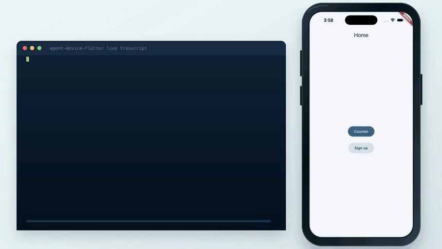

# agent-device-flutter

iOS, Android, macOS, Linux 및 TV 변형 플랫폼에서 실행 중인 **Flutter** 앱을 위한 UI 자동화 CLI입니다.

`agent-device-flutter`는 터미널에서 실제 기기의 실제 앱을 조작합니다. 접근성 트리를 나열하고, 위젯을 찾고, 탭하고, 입력하고, 스크롤하고, assert하고, replay 스크립트를 실행할 수 있습니다. 결정적인 ref 기반 UI 뷰가 필요한 AI 에이전트와, 프레임워크별 테스트 보일러플레이트 없이 모바일 플로우를 스크립트로 다루고 싶은 사람을 위해 만들었습니다.

[`agent-device`](https://github.com/callstackincubator/agent-device)에서 영감을 받았습니다. `agent-device`는 Callstack의 프레임워크 독립적이고 React Native 지향적인 자동화 CLI입니다. 이 프로젝트는 Flutter에 집중한 **독립적인 standalone 구현**입니다. `agent-device`에 의존하거나, import하거나, 감싸지 않습니다. 세션 모델과 ref 기반 상호작용 방식은 차용했지만, 코드와 contract, 릴리스 사이클은 이 프로젝트의 것입니다.

> 상태: **stable 1.0.0**. iOS Simulator, Android 기기/에뮬레이터, macOS, Linux에서 Dart VM Service를 통해 실제 debug-mode Flutter 앱을 조작합니다.

영어로 읽기: [README.md](./README.md).

<p align="center">
  <a href="./docs/assets/agent-device-flutter-demo.mp4">
    
  </a>
</p>

## AI에게 이렇게 보내세요

내 Flutter 앱에서 직접 사용해보고 싶다면, AI 에이전트에게 이 GitHub 주소와 함께 아래처럼 요청하세요.

```text
이 저장소를 사용해서 내 Flutter 앱을 조작해줘.
https://github.com/3x-haust/agent-device-flutter

앱을 실행하거나 Dart VM Service URL에 연결한 뒤,
agent-device-flutter snapshot -i 로 화면을 읽어줘.
press/fill/scroll 후에는 매번 다시 snapshot을 찍어줘.
가능하면 Semantics identifier를 우선 사용하고,
재사용할 플로우는 replay 스크립트로 만들어줘.
```

## 기능

- **Flutter-first**. `pubspec.yaml`을 읽어 프로젝트 모드, flavor, entrypoint를 감지합니다. `Semantics` 위젯 커버리지를 중요한 개념으로 다룹니다.
- **세션 모델**. target을 `open`하고, `snapshot`을 찍고, ref(`@e3`)에 액션을 실행한 뒤 `close`합니다. 모든 플랫폼에서 같은 루프를 사용합니다.
- **Dart VM Service snapshot**. debug-mode VM Service를 통해 Flutter `Semantics` 트리를 덤프합니다. 앱 안에 별도 runtime package를 넣을 필요가 없습니다.
- **Ref 기반 상호작용**. Snapshot은 `press`, `fill`, `scroll`에 다시 넣을 수 있는 안정적인 `@e<N>` ref를 할당합니다.
- **Replay 스크립트**. `.adf` 파일로 명령 시퀀스를 저장하고 retries와 artifacts를 함께 다룰 수 있습니다.
- **Dev-runtime hooks**. `dev-run`은 detached daemon으로 `flutter run --machine`을 관리합니다. `hot-reload` / `hot-restart`는 어떤 shell에서든 Unix socket control channel을 통해 도달합니다.
- **Remote-ready**. 접근 가능한 Dart VM Service URI라면 어디든 attach할 수 있어 CI와 원격 기기를 노트북 밖에 둘 수 있습니다.

## 설치

```bash
npm install -g agent-device-flutter
# 또는
pnpm add -g agent-device-flutter
```

Node.js `>= 22`가 필요합니다.

플랫폼별 추가 도구:

| 대상 | 필요 도구 |
| --- | --- |
| iOS Simulator | Xcode + `xcrun simctl` |
| iOS 실제 기기 | `devicectl` (Xcode 15+) 또는 `idevice*` toolchain |
| Android | `$PATH`에 잡힌 `adb` |
| Linux | AT-SPI2 runtime (`at-spi2-core`) |
| Flutter dev-runtime | Flutter SDK `>= 3.22` (`dev-run` / `hot-reload`에만 필요) |

## 빠른 시작

세션을 여는 방법은 두 가지입니다. 워크플로우에 맞는 방식을 고르세요.

### A. Dev-run (앱 실행까지 맡고, hot reload를 활성화)

```bash
# Flutter 프로젝트 루트에서:
agent-device-flutter dev-run .              # detached `flutter run --machine` daemon
agent-device-flutter snapshot -i
agent-device-flutter press @e7
agent-device-flutter fill @e12 "hello flutter"
agent-device-flutter hot-reload             # build_runner 스타일 hot reload 재실행
agent-device-flutter hot-restart            # root isolate 전체 재시작
agent-device-flutter close                  # daemon을 멈추고 세션을 정리
```

### B. Attach (Flutter SDK 없이, 접근 가능한 Dart VM Service만 사용)

```bash
# 이미 `flutter run`, Xcode, Android Studio로 앱을 실행 중이라면,
# 출력된 Dart VM Service URL 또는 `--observatory-uri`를 복사하세요:
agent-device-flutter open ws://127.0.0.1:56799/xhwpYR3mplM=/ws
agent-device-flutter snapshot -i
agent-device-flutter press @e7
agent-device-flutter close
```

어떤 방식이든 세션이 생긴 뒤에는 다른 모든 명령(`snapshot`, `press`, `fill`, `scroll`, `doctor`, `replay`)이 VM Service를 직접 조작합니다. iOS, Android, macOS, Linux에서 동일하게 동작합니다.

## Snapshot 예시

```bash
$ agent-device-flutter snapshot -i
Snapshot: 9 visible nodes (14 total)
@e1 [application] "Runner"
  @e2 [window]
    @e4 [other] "Home"
      @e5 [navigation-bar] "Home"
        @e6 [button] "Menu"
        @e7 [text] "Home"
      @e8 [other] "Counter"
        @e9 [text] "0"
        @e10 [button] "Increment"
[off-screen below] 2 interactive items: "Settings", "About"
```

옵션:

| Flag | 설명 |
| --- | --- |
| `-i` | Interactive-only 출력. 에이전트에게 권장 |
| `-c` | Compact. 빈 노드를 제거 |
| `-d <depth>` | 트리 깊이 제한 |
| `-s <scope>` | label, identifier, `@ref`로 범위 제한 |
| `--raw` | 전체 트리. 문제 해결용 |
| `--diff` | 이전 snapshot과 unified-style diff 출력 |

## Semantics — Flutter 앱을 에이전트 친화적으로 만들기

Snapshot 품질은 위젯 트리가 노출하는 접근성 정보에 달려 있습니다. `Semantics`를 사용해 에이전트가 안정적으로 찾을 수 있고, 지역화 가능한 anchor를 주세요.

```dart
Semantics(
  identifier: 'submit-button',   // 안정적인 ref anchor. 에이전트는 이것을 기준으로 삼음
  label: 'Submit order',         // 사람이 읽을 수 있고 지역화 가능한 label
  button: true,
  child: ElevatedButton(
    onPressed: _submit,
    child: const Text('Submit'),
  ),
)
```

`agent-device-flutter doctor`를 실행하면 현재 화면을 스캔해 다음 문제를 표시합니다.

- label이 없는 interactive node (`Button` role이지만 label이 비어 있는 경우)
- 한 화면 안에서 중복된 `identifier`
- coordinate-only ref가 지나치게 많은 화면

## Replay 스크립트

`.adf` 스크립트는 optional retries와 artifact capture를 포함하는 명령 시퀀스입니다.

```text
open ./build/app/outputs/flutter-apk/app-debug.apk
snapshot -i
press @e10
fill @e12 "order-42"
press #label="Submit order"
assert visible #label="Thanks"
screenshot receipt.png
close
```

실행:

```bash
agent-device-flutter replay ./flows/checkout.adf
agent-device-flutter test ./flows/ --retries 2 --artifacts ./out
```

## 예제

실행 가능한 Flutter 샘플 앱은 [`example/`](./example)에 있습니다. Counter와 sign-up form, 잘 붙은 `Semantics` 위젯, 바로 실행할 수 있는 `.adf` replay 스크립트가 포함되어 있습니다. 실제 기기에서 CLI를 end-to-end로 시도할 때 권장하는 시작점입니다.

## 하지 않는 것

- Flutter Web 자동화. 이 프로젝트는 DOM이 아니라 native a11y tree를 대상으로 합니다.
- widget-level unit testing을 위한 `flutter_driver` / `integration_test` 대체.
- Windows host 지원. 수요가 생기기 전까지 Windows는 범위 밖입니다.

출시된 릴리스와 다음 계획은 [CHANGELOG.md](./CHANGELOG.md)를 참고하세요.

## 기여

먼저 [CONTRIBUTING.md](./CONTRIBUTING.md)를 읽어주세요. 에이전트 기반 contributor는 [AGENTS.md](./AGENTS.md)도 읽어야 합니다. Claude Code 사용자는 [CLAUDE.md](./CLAUDE.md)에 프로젝트별 가이드가 있습니다.

## 라이선스

MIT © Contributors. 자세한 내용은 [LICENSE](./LICENSE)를 참고하세요.
